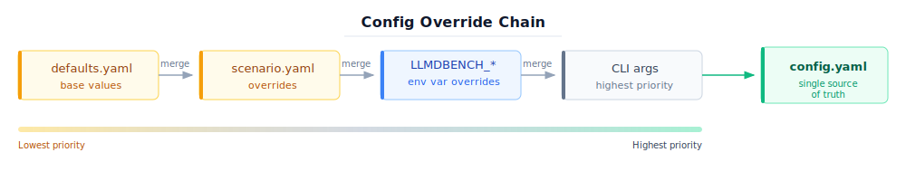

# llm-d-benchmark

Automated workflow for benchmarking LLM inference using the `llm-d` stack. Includes tools for deployment, experiment execution, data collection, and teardown across multiple environments and deployment styles.

## Main Goal

Provide a single source of automation for repeatable and reproducible experiments and performance evaluation on `llm-d`.

## Prerequisites

Please refer to the official [llm-d prerequisites](https://github.com/llm-d/llm-d/blob/main/README.md#pre-requisites) for the most up-to-date requirements.

### System Requirements

- **Python 3.11+**
- **kubectl** -- Kubernetes CLI
- **helm** -- Helm package manager
- **curl**, **git** -- Standard system tools
- **helmfile** (optional) -- Required for modelservice deployments
- **oc** (optional) -- Required for OpenShift clusters

### Administrative Requirements

Deploying the llm-d stack requires **cluster-level admin** privileges for configuring cluster-level resources. However, **namespace-level admin** users can run the tool as long as [Kubernetes infrastructure components](https://github.com/llm-d-incubation/llm-d-infra) are configured and the target namespace already exists. Use `--non-admin` to skip admin-only steps.

## Installation

### Quick Install (recommended)

```bash
git clone https://github.com/llm-d/llm-d-benchmark.git
cd llm-d-benchmark
./install.sh
source .venv/bin/activate
```

The install script:

1. Creates a Python virtual environment at `.venv/`
2. Validates Python 3.11+ and pip
3. Checks for required system tools (curl, git, kubectl, helm)
4. Checks for optional tools (oc, helmfile, kustomize, jq, yq, skopeo)
5. Installs `llmdbenchmark` and `config_explorer` in editable mode
6. Verifies all Python packages are importable

**Flags:**

- `-y` -- Non-interactive mode (use system Python, skip venv creation)
- `noreset` -- Reuse cached dependency checks from previous run
- `-h` -- Show help

### Manual Install

```bash
git clone https://github.com/llm-d/llm-d-benchmark.git
cd llm-d-benchmark
python3 -m venv .venv && source .venv/bin/activate
pip install -e .
pip install -e config_explorer/
```

### Verify Installation

```bash
llmdbenchmark --version
```

## Quickstart

Every command requires a **specification file** (`--spec`) that tells the tool where to find templates, defaults, and scenario overrides. You can pass a **bare name**, a **category/name**, or a **full path**:

```bash
--spec gpu                              # searches config/specification/**/gpu.yaml.j2
--spec guides/inference-scheduling      # searches config/specification/guides/inference-scheduling.yaml.j2
--spec /full/path/to/my-spec.yaml.j2    # exact path
```

If the name is not found, the CLI prints all available specifications and exits.

### 1. Plan (render templates into manifests)

```bash
llmdbenchmark --spec inference-scheduling plan
```

This renders Jinja2 templates into complete Kubernetes YAML manifests without touching the cluster. Output goes to a temporary workspace directory.

### 2. Standup (deploy to cluster)

```bash
llmdbenchmark --spec inference-scheduling standup
```

This plans and then applies all resources to the cluster. Steps 00-10 run sequentially for global resources, then in parallel across model stacks.

**Dry run** (generate YAML without applying):

```bash
llmdbenchmark --spec inference-scheduling --dry-run standup
```

**Non-admin** (skip admin-only steps like CRDs, gateway, cluster roles):

```bash
llmdbenchmark --spec inference-scheduling --non-admin standup
```

**Run specific steps only:**

```bash
llmdbenchmark --spec inference-scheduling standup -s 0,4-6,10
```

### 3. Run (execute benchmarks)

```bash
llmdbenchmark --spec inference-scheduling run \
    -l inference-perf -w sanity_random.yaml
```

**Run-only mode** (against an existing stack, no planning):

```bash
llmdbenchmark --spec inference-scheduling run \
    -U http://my-model-endpoint:8000 -l inference-perf -w sanity_random.yaml
```

### 4. Teardown (clean up)

```bash
llmdbenchmark --spec inference-scheduling teardown
```

**Deep clean** (remove ALL resources in both namespaces):

```bash
llmdbenchmark --spec inference-scheduling teardown --deep
```

## CLI Reference

### Global Options

| Flag | Env Var | Description |
|------|---------|-------------|
| `--spec SPEC` | `LLMDBENCH_SPEC` | Specification name or path (bare name, category/name, or full path) |
| `--workspace DIR` / `--ws` | `LLMDBENCH_WORKSPACE` | Workspace directory for outputs (default: temp dir) |
| `--base-dir DIR` / `--bd` | `LLMDBENCH_BASE_DIR` | Base directory for templates/scenarios (default: `.`) |
| `--non-admin` / `-i` | `LLMDBENCH_NON_ADMIN` | Skip admin-only steps |
| `--dry-run` / `-n` | `LLMDBENCH_DRY_RUN` | Generate YAML without applying to cluster |
| `--verbose` / `-v` | `LLMDBENCH_VERBOSE` | Enable debug logging |
| `--version` | | Show version |

### Standup Options

| Flag | Env Var | Description |
|------|---------|-------------|
| `-s STEPS` | | Step filter (e.g., `0,1,5` or `1-7`) |
| `-c FILE` | `LLMDBENCH_SCENARIO` | Scenario file |
| `-m MODELS` | `LLMDBENCH_MODELS` | Models to deploy |
| `-p NS` | `LLMDBENCH_NAMESPACE` | Namespace(s) |
| `-t METHODS` | `LLMDBENCH_METHODS` | Deployment methods (`standalone`, `modelservice`) |
| `-r NAME` | `LLMDBENCH_RELEASE` | Helm release name |
| `-k FILE` | `LLMDBENCH_KUBECONFIG` / `KUBECONFIG` | Kubeconfig path |
| `--parallel N` | `LLMDBENCH_PARALLEL` | Max parallel stacks (default: 4) |
| `--monitoring` | `LLMDBENCH_MONITORING` | Enable workload monitoring |
| `--affinity` | `LLMDBENCH_AFFINITY` | Node affinity / tolerations label |
| `--annotations` | `LLMDBENCH_ANNOTATIONS` | Extra annotations for deployed resources |
| `--wva` | `LLMDBENCH_WVA` | Workload Variant Autoscaler config |

### Teardown Options

| Flag | Env Var | Description |
|------|---------|-------------|
| `-s STEPS` | | Step filter |
| `-m MODELS` | `LLMDBENCH_MODELS` | Model that was deployed (for resource name resolution) |
| `-t METHODS` | `LLMDBENCH_METHODS` | Methods to tear down (`standalone`, `modelservice`) |
| `-r NAME` | `LLMDBENCH_RELEASE` | Helm release name (default: `llmdbench`) |
| `-d` / `--deep` | `LLMDBENCH_DEEP_CLEAN` | Deep clean: delete ALL resources in both namespaces |
| `-p NS` | `LLMDBENCH_NAMESPACE` | Comma-separated namespaces (model,harness) |
| `-k FILE` | `LLMDBENCH_KUBECONFIG` / `KUBECONFIG` | Kubeconfig path |

### Run Options

| Flag | Env Var | Description |
|------|---------|-------------|
| `-m MODEL` | `LLMDBENCH_MODEL` | Model name override (e.g. facebook/opt-125m) |
| `-p NS` | `LLMDBENCH_NAMESPACE` | Namespaces (deploy,benchmark) |
| `-t METHODS` | `LLMDBENCH_METHODS` | Deploy method used during standup |
| `-k FILE` | `LLMDBENCH_KUBECONFIG` / `KUBECONFIG` | Kubeconfig path |
| `-l HARNESS` | `LLMDBENCH_HARNESS` | Harness name (inference-perf, guidellm, vllm-benchmark) |
| `-w PROFILE` | `LLMDBENCH_WORKLOAD` | Workload profile YAML |
| `-e FILE` | `LLMDBENCH_EXPERIMENTS` | Experiment treatments YAML for parameter sweeping |
| `-o OVERRIDES` | `LLMDBENCH_OVERRIDES` | Workload parameter overrides (param=value,...) |
| `-r DEST` | `LLMDBENCH_OUTPUT` | Results destination (local, gs://, s3://) |
| `-j N` | `LLMDBENCH_PARALLELISM` | Parallel harness pods |
| `-U URL` | `LLMDBENCH_ENDPOINT_URL` | Explicit endpoint URL (run-only mode) |
| `-c FILE` | | Run config YAML (run-only mode) |
| `--generate-config` | | Generate config and exit |
| `-x DATASET` | `LLMDBENCH_DATASET` | Dataset URL for harness replay |
| `--wait-timeout N` | `LLMDBENCH_WAIT_TIMEOUT` | Seconds to wait for harness completion |
| `-z` / `--skip` | `LLMDBENCH_SKIP` | Skip execution, only collect existing results |
| `-d` / `--debug` | `LLMDBENCH_DEBUG` | Debug mode: start harness pods with sleep infinity |

### Environment Variables

Every CLI flag can be set via a `LLMDBENCH_*` environment variable (see tables above). The priority chain is:

1. **CLI flag** (highest) -- explicitly passed on the command line
2. **Environment variable** -- exported in the user's shell
3. **Rendered config** (lowest) -- defaults.yaml + scenario YAML

This is useful for CI/CD pipelines, `.bashrc` configuration, or migrating from the original bash-based workflow.

```bash
# Example: set common defaults via env vars, override per-run via CLI
export LLMDBENCH_SPEC=inference-scheduling
export LLMDBENCH_NAMESPACE=my-team-ns
export LLMDBENCH_KUBECONFIG=~/.kube/my-cluster

# These use the env vars above; --dry-run overrides nothing, just adds a flag
llmdbenchmark standup --dry-run
llmdbenchmark standup                          # live deploy to my-team-ns
llmdbenchmark standup -p override-ns           # CLI wins over env var
```

Boolean env vars accept `1`, `true`, or `yes` (case-insensitive). Active `LLMDBENCH_*` overrides are logged at startup for debugging.

## Architecture

The tool operates in three phases, each composed of numbered steps executed by a shared [`StepExecutor`](llmdbenchmark/executor/README.md) framework.

### [Config Override Chain](config/README.md#config-override-chain)

Values flow through a merge pipeline during the plan phase:



Steps read from the rendered `config.yaml` and never define their own fallback defaults. If a required key is missing from the rendered config, the step raises a clear error. This ensures `defaults.yaml` is the single source of truth for all default values. Environment variables (`LLMDBENCH_*`) sit between scenario overrides and CLI flags in the priority chain.

See [config/README.md](config/README.md) for the full configuration reference, including [how to override values](config/README.md#how-to-override-values).

### [Deployment Methods](llmdbenchmark/standup/README.md#deployment-methods)

The standup phase supports two deployment paths:

- **standalone** -- Direct Kubernetes Deployments and Services for each model (step 06)
- **modelservice** -- Helm-based deployment with gateway infrastructure, GAIE, and LWS support (steps 07-09)

Both paths share steps 00-05 (infrastructure, namespaces, secrets) and step 10 (smoketest).

### [Standup Steps](llmdbenchmark/standup/README.md)

| Step | Name | Scope | Description |
|------|------|-------|-------------|
| 00 | ensure_infra | Global | Validate dependencies, cluster connectivity, kubeconfig |
| 02 | admin_prerequisites | Global | Admin prerequisites (CRDs, gateway, LWS, namespaces) |
| 03 | workload_monitoring | Global | Workload monitoring, node resource discovery |
| 04 | model_namespace | Per-stack | Model namespace (PVCs, secrets, download job) |
| 05 | harness_namespace | Per-stack | Harness namespace (PVC, data access pod, preprocess) |
| 06 | standalone_deploy | Per-stack | Standalone vLLM deployment (Deployment + Service) |
| 07 | deploy_setup | Per-stack | Helm repos and gateway infrastructure (helmfile) |
| 08 | deploy_gaie | Per-stack | GAIE inference extension deployment |
| 09 | deploy_modelservice | Per-stack | Modelservice deployment (helmfile + LWS) |
| 10 | smoketest | Per-stack | Smoketest (endpoint health, model serving validation) |

### [Teardown Steps](llmdbenchmark/teardown/README.md)

| Step | Name | Description | Condition |
|------|------|-------------|-----------|
| 00 | preflight | Validate cluster connectivity, load config | Always |
| 01 | uninstall_helm | Uninstall Helm releases, delete routes and jobs | Modelservice only |
| 02 | clean_harness | Clean harness ConfigMaps, pods, secrets | Always |
| 03 | delete_resources | Delete namespaced resources (normal or deep) | Always |
| 04 | clean_cluster_roles | Clean cluster-scoped ClusterRoles/Bindings | Admin + modelservice only |

## Project Structure

```text
config/                       Declarative configuration (all plan-phase inputs)
    templates/
        jinja/                Jinja2 templates for Kubernetes manifests
        values/defaults.yaml  Base configuration with all anchored defaults
    scenarios/                Deployment overrides (guides/, examples/, cicd/)
    specification/            Specification templates (guides/, examples/, cicd/)

llmdbenchmark/                Python package
    cli.py                    Entry point, workspace setup, command dispatch
    config.py                 Plan-phase workspace configuration singleton

    interface/                CLI subcommand definitions (argparse)
        commands.py           Command enum (plan, standup, teardown, run)
        env.py                Environment variable helpers for CLI defaults
        plan.py               Plan subcommand
        standup.py            Standup subcommand
        teardown.py           Teardown subcommand
        run.py                Run subcommand

    parser/                   Plan-phase template rendering (see parser/README.md)
        render_specification.py   Specification file parsing and validation
        render_plans.py           Jinja2 template rendering engine
        render_result.py          Structured error tracking for renders
        version_resolver.py       Auto-resolve image tags and chart versions
        cluster_resource_resolver.py  Auto-detect accelerator/network values

    executor/                 Execution framework (see executor/README.md)
        step.py               Step ABC, Phase enum, result dataclasses
        step_executor.py      Step orchestrator (sequential + parallel)
        command.py            kubectl/helm/helmfile subprocess wrapper
        context.py            Shared state (ExecutionContext dataclass)
        deps.py               System dependency checker

    standup/                  Standup phase (see standup/README.md)
        preprocess/           Scripts mounted as ConfigMaps in vLLM pods
        steps/                Step implementations (00-10)

    teardown/                 Teardown phase (see teardown/README.md)
        steps/                Step implementations (00-05)

    run/                      Run phase (benchmark execution)
        steps/                Step implementations

    logging/                  Structured logger with emoji support (see logging/README.md)
    exceptions/               Error hierarchy (Template, Configuration, Execution)
    utilities/                Shared helpers (see utilities/README.md)
        cluster.py            Kubernetes connection, platform detection
        capacity_validator.py GPU capacity validation
        huggingface.py        HuggingFace model access checks
        os/
            filesystem.py     Workspace and directory management
            platform.py       Host OS detection
```

See module-level READMEs for detailed documentation:

- [executor/README.md](llmdbenchmark/executor/README.md) -- Execution framework and step contribution guide
- [standup/README.md](llmdbenchmark/standup/README.md) -- Standup phase details
- [teardown/README.md](llmdbenchmark/teardown/README.md) -- Teardown phase details
- [parser/README.md](llmdbenchmark/parser/README.md) -- Plan-phase rendering pipeline
- [logging/README.md](llmdbenchmark/logging/README.md) -- Logger, stream separation, file logging
- [utilities/README.md](llmdbenchmark/utilities/README.md) -- Shared utilities, workspace architecture

## Main Concepts

### [Scenarios](docs/standup.md#scenarios)

Cluster-specific configuration: GPU model, LLM, and `llm-d` parameters.

### [Harnesses](docs/run.md#harnesses)

Load generators that drive benchmark traffic. Supported: [inference-perf](https://github.com/kubernetes-sigs/inference-perf), [guidellm](https://github.com/vllm-project/guidellm.git), [vllm benchmarks](https://github.com/vllm-project/vllm.git), [inferencemax](https://github.com/InferenceMAX/InferenceMAX.git), and nop (for model load time benchmarking).

### (Workload) [Profiles](docs/run.md#profiles)

Benchmark load specifications including LLM use case, traffic pattern, input/output distribution, and dataset. Found under [`workload/profiles`](./workload/profiles).

### [Experiments](docs/doe.md)

Design of Experiments (DOE) files describing parameter sweeps across standup and run configurations.

## Dependencies

- [llm-d-infra](https://github.com/llm-d-incubation/llm-d-infra.git)
- [llm-d-modelservice](https://github.com/llm-d/llm-d-model-service.git)
- [inference-perf](https://github.com/kubernetes-sigs/inference-perf)

## Topics

- [Reproducibility](docs/reproducibility.md)
- [Observability](docs/observability.md)
- [Quickstart](docs/quickstart.md)
- [Resource Requirements](docs/resource_requirements.md)
- [FAQ](docs/faq.md)

## Contribute

- [How to contribute](CONTRIBUTING.md), including development process and governance.
- See [executor/README.md](llmdbenchmark/executor/README.md) for the step contribution guide (how to add new steps).
- Join [Slack](https://llm-d.ai/slack) (`sig-benchmarking` channel) for cross-org development discussion.
- Bi-weekly contributor standup: Tuesdays 13:00 EST. [Calendar](https://calendar.google.com/calendar/u/0?cid=NzA4ZWNlZDY0NDBjYjBkYzA3NjdlZTNhZTk2NWQ2ZTc1Y2U5NTZlMzA5MzhmYTAyZmQ3ZmU1MDJjMDBhNTRiNEBncm91cC5jYWxlbmRhci5nb29nbGUuY29t) | [Meeting notes](https://docs.google.com/document/d/1njjeyBJF6o69FlyadVbuXHxQRBGDLcIuT7JHJU3T_og/edit?usp=sharing) | [Google group](https://groups.google.com/g/llm-d-contributors)

## License

Licensed under Apache License 2.0. See [LICENSE](LICENSE) for details.
