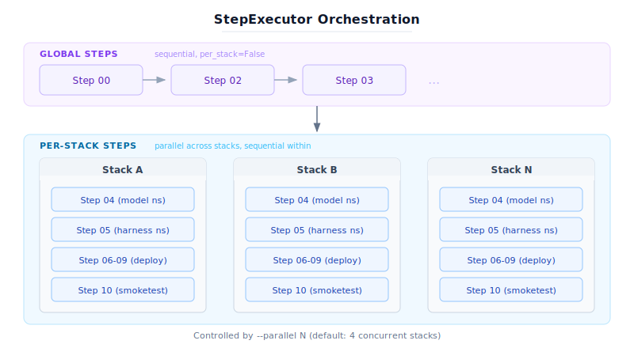

# Executor Framework

The executor module provides the phase-agnostic execution framework used by standup, run, and teardown phases. It defines the step abstraction, orchestration logic, command execution wrapper, and shared context.

## Module Structure

```text
executor/
    step.py               Step ABC, Phase enum, StepResult, ExecutionResult
    step_executor.py      Step orchestrator (sequential + parallel)
    command.py            kubectl/helm/helmfile subprocess wrapper
    context.py            Shared state (ExecutionContext dataclass)
    protocols.py          Structural typing (LoggerProtocol)
    deps.py               System dependency checker
```

## Core Concepts

### Step (Abstract Base Class)

Every step in every phase (standup, run, teardown) subclasses `Step`. A step represents a discrete unit of work with these attributes:

| Attribute | Type | Description |
|-----------|------|-------------|
| `number` | `int` | Step number for ordering and filtering (e.g., 0, 2, 4) |
| `name` | `str` | Short identifier (e.g., `"ensure_infra"`) |
| `description` | `str` | Human-readable description |
| `phase` | `Phase` | Which lifecycle phase: `STANDUP`, `RUN`, or `TEARDOWN` |
| `per_stack` | `bool` | `True` = runs once per rendered stack (parallelizable); `False` = runs once globally |

### Phase Enum

```python
class Phase(Enum):
    STANDUP = "standup"
    RUN = "run"
    TEARDOWN = "teardown"
```

### StepResult

Returned by every step's `execute()` method:

| Field | Type | Description |
|-------|------|-------------|
| `step_number` | `int` | Step number |
| `step_name` | `str` | Step name |
| `success` | `bool` | Whether the step succeeded |
| `message` | `str` | Human-readable status message |
| `errors` | `list[str]` | List of error messages |
| `stack_name` | `str \| None` | Stack name (for per-stack steps) |
| `context` | `dict` | Arbitrary key-value data (e.g., deployed endpoints) |

### ExecutionContext

A shared dataclass passed through all steps. Populated incrementally:

- **Initialization:** Core paths, flags, CLI overrides
- **Step 00:** Kubernetes connection, platform detection, kubeconfig
- **Steps 02-05:** Namespace info, proxy UID
- **Steps 06/09/10:** Deployed endpoints, methods

Key fields:

| Field | Description |
|-------|-------------|
| `plan_dir` | Path to rendered plan directory |
| `workspace` | Path to workspace directory |
| `rendered_stacks` | List of paths to rendered stack directories |
| `dry_run` | Generate YAML without applying |
| `non_admin` | Skip admin-only steps |
| `current_phase` | Current execution phase |
| `cmd` | Shared `CommandExecutor` instance |
| `namespace` | Deploy namespace |
| `harness_namespace` | Harness/benchmark namespace |
| `deployed_methods` | List of active deployment methods |
| `is_openshift` | True if running on OpenShift |

### LoggerProtocol

Defined in `protocols.py`, `LoggerProtocol` provides structural typing for the logger interface. Any object implementing these four methods satisfies the protocol:

```python
class LoggerProtocol(Protocol):
    def log_info(self, msg: str, *, emoji: str = "") -> None: ...
    def log_warning(self, msg: str) -> None: ...
    def log_error(self, msg: str) -> None: ...
    def set_indent(self, level: int) -> None: ...
```

The `ExecutionContext.logger` field is typed as `LoggerProtocol | None`. Both the full `LLMDBenchmarkLogger` and the internal `_MinimalLogger` satisfy this protocol.

### CommandExecutor

Subprocess wrapper for `kubectl`, `helm`, and `helmfile` commands:

```python
cmd = context.require_cmd()

# Run kubectl
result = cmd.kubectl("get pods -n my-namespace")

# Run helm
result = cmd.helm("list -A")

# Run helmfile
result = cmd.helmfile("apply", work_dir="/path/to/helmfile")

# Run arbitrary command
result = cmd.run("curl http://localhost:8000/health")
```

Returns `CommandResult` with `exit_code`, `stdout`, `stderr`, `success`, and `dry_run` flag.

### StepExecutor

Orchestrates step execution with two phases:

1. **Global steps** (`per_stack=False`): Run sequentially. If any fails, execution aborts.
2. **Per-stack steps** (`per_stack=True`): Run in parallel across rendered stacks using `ThreadPoolExecutor`. Each stack runs its per-stack steps sequentially.



The `--parallel` flag controls how many stacks run concurrently (default: 4).

**Step filtering:** Users can run specific steps via `-s`:

```bash
llmdbenchmark ... standup -s 0,4-6,10    # Only steps 0, 4, 5, 6, 10
llmdbenchmark ... standup -s 10           # Only step 10
```

## Shared Step Helpers

The `Step` base class provides helpers available to all steps:

| Method | Description |
|--------|-------------|
| `_resolve(plan_config, *config_paths, context_value, default)` | Three-tier config resolution with fallback chain |
| `_require_config(config, *keys)` | Read a required value from rendered config; raises `KeyError` if missing |
| `_load_plan_config(context)` | Load `config.yaml` from the first rendered stack |
| `_load_stack_config(stack_path)` | Load `config.yaml` from a specific stack directory |
| `_find_rendered_yaml(context, prefix)` | Find a rendered YAML file by prefix across all stacks |
| `_find_yaml(stack_path, prefix)` | Find a YAML file by prefix in a stack directory |
| `_has_yaml_content(yaml_path)` | Check if a rendered YAML file has non-empty content |
| `_all_target_namespaces(context)` | Collect all unique namespaces from all stacks |
| `_check_existing_pvc(cmd, context, pvc_name, size, ns, errors)` | Check PVC existence and validate size |
| `_parse_size_gi(size_str)` | Parse Kubernetes quantity string to GiB |

### `_resolve()` Pattern

For run-phase steps that need CLI overrides, `_resolve()` provides a three-tier fallback:

1. **context_value** -- Runtime override from CLI / ExecutionContext (highest priority)
2. **plan_config** -- Nested lookup via dotted config paths
3. **default** -- Fallback value (lowest priority)

```python
# Single config path
harness_name = self._resolve(
    plan_config, "harness.name",
    context_value=context.harness_name,
    default="inference-perf",
)

# Multiple config paths (fallback chain)
profile_name = self._resolve(
    plan_config, "harness.experimentProfile", "harness.profile",
    context_value=context.harness_profile,
    default="sanity_random.yaml",
)
```

Use `_resolve()` when a value can come from multiple sources (CLI flag, experiment file, rendered config). Use `_require_config()` when a value must exist in the rendered config.

### `_require_config()` Pattern

Steps must use `_require_config()` to read values from the rendered config. This ensures `defaults.yaml` is the single source of truth:

```python
# Read a nested value -- raises KeyError if missing
port = self._require_config(plan_config, "vllmCommon", "inferencePort")
release = self._require_config(plan_config, "release")
replicas = self._require_config(plan_config, "decode", "replicas")

# DO NOT use .get() with hardcoded defaults in steps:
# port = plan_config.get("vllmCommon", {}).get("inferencePort", 8000)  # WRONG
```

---

## Adding a New Step

### 1. Create the Step File

Create a new file in the appropriate phase directory:

- Standup: `llmdbenchmark/standup/steps/step_NN_your_step.py`
- Teardown: `llmdbenchmark/teardown/steps/step_NN_your_step.py`
- Run: `llmdbenchmark/run/steps/step_NN_your_step.py`

### 2. Implement the Step Class

```python
"""
llmdbenchmark.standup.steps.step_NN_your_step

Brief description of what this step does.
"""

from pathlib import Path

from llmdbenchmark.executor.step import Step, StepResult, Phase
from llmdbenchmark.executor.context import ExecutionContext


class YourStep(Step):
    """One-line description of the step."""

    def __init__(self):
        super().__init__(
            number=NN,                          # Step number (determines execution order)
            name="your_step",                   # Short identifier
            description="What this step does",  # Human-readable description
            phase=Phase.STANDUP,                # STANDUP, RUN, or TEARDOWN
            per_stack=True,                     # True = runs per stack; False = runs once
        )

    def should_skip(self, context: ExecutionContext) -> bool:
        """Optional: return True to skip this step based on context."""
        # Example: skip if not using standalone deployment
        return "standalone" not in context.deployed_methods

    def execute(
        self, context: ExecutionContext, stack_path: Path | None = None
    ) -> StepResult:
        """Execute this step."""
        cmd = context.require_cmd()
        logger = context.logger

        # For per-stack steps, load stack-specific config
        if stack_path:
            plan_config = self._load_stack_config(stack_path)
        else:
            plan_config = self._load_plan_config(context)

        if not plan_config:
            return StepResult(
                step_number=self.number,
                step_name=self.name,
                success=False,
                message="No plan config found",
            )

        # Read required values from rendered config
        namespace = self._require_config(plan_config, "namespace", "name")
        release = self._require_config(plan_config, "release")

        # Find and apply rendered YAML
        yaml_file = self._find_yaml(stack_path, "14_")
        if yaml_file and self._has_yaml_content(yaml_file):
            result = cmd.kubectl(f"apply -f {yaml_file} -n {namespace}")
            if not result.success:
                return StepResult(
                    step_number=self.number,
                    step_name=self.name,
                    success=False,
                    message=f"kubectl apply failed: {result.stderr}",
                    errors=[result.stderr],
                )

        return StepResult(
            step_number=self.number,
            step_name=self.name,
            success=True,
            message="Resources applied successfully",
        )
```

### 3. Register the Step

Add the step to the phase's registry in `steps/__init__.py`:

```python
from llmdbenchmark.standup.steps.step_NN_your_step import YourStep

def get_standup_steps() -> list[Step]:
    return [
        # ... existing steps ...
        YourStep(),
        # ... existing steps ...
    ]
```

Steps are automatically sorted by `number` by `StepExecutor`, so insertion order in the list doesn't matter for execution.

### 4. Add Config Keys (if needed)

If your step reads new config values:

1. Add the default value to `config/templates/values/defaults.yaml`
2. Use `_require_config()` in your step to read it
3. Document the new key in the scenario examples

### Key Guidelines

- **Use `_require_config()`** for config values that must exist in the rendered plan. Never use `.get("key", default)` in steps.
- **Use `_resolve()`** for values that can come from CLI, experiment file, or config (three-tier fallback).
- **Return `StepResult`** from `execute()` -- never raise exceptions (the executor catches them but it's better to return structured results).
- **Use `context.require_cmd()`** to get the `CommandExecutor`. It raises if step 00 hasn't run yet.
- **Check `context.dry_run`** -- if True, log what would happen but don't modify cluster state. The `CommandExecutor` handles this automatically for kubectl/helm commands.
- **Use `should_skip()`** for conditional execution -- e.g., standalone-only steps should skip when method is modelservice.
- **For per-stack steps:** the `stack_path` parameter points to the rendered stack directory containing `config.yaml` and all rendered YAMLs.
- **For global steps:** `stack_path` is `None`. Use `_load_plan_config(context)` to load config from the first stack.

---

## Step I/O Contracts

Steps communicate through `ExecutionContext` fields. This table documents which fields each run-phase step reads and writes:

| Step | Reads | Writes |
|------|-------|--------|
| 00 preflight | `kubeconfig`, `namespace` | `cmd` (via cluster.resolve_cluster) |
| 01 cleanup_previous | `harness_namespace`, pod labels | -- |
| 02 detect_endpoint | `endpoint_url`, `deployed_methods`, `namespace` | `deployed_endpoints[stack]` |
| 03 verify_model | `model_name`, `deployed_endpoints` | -- |
| 04 render_profiles | `harness_name`, `harness_profile`, `experiments_file` | `treatments` (list), rendered profiles on disk |
| 05 create_configmap | `harness_name`, `harness_namespace` | ConfigMaps in cluster |
| 06 deploy_harness | `harness_*`, `model_name`, `deployed_endpoints`, `treatments` | Results on disk, `results_dir` |
| 07 wait_completion | `harness_pod_names`, `wait_timeout` | -- |
| 08 collect_results | `harness_namespace`, `results_dir_prefix` | Results on disk |
| 09 upload_results | `harness_output`, `run_results_dir()` | -- |
| 10 cleanup_post | `harness_namespace`, pod labels | -- |
| 11 analyze_results | `harness_name`, `run_results_dir()` | Analysis output on disk |
