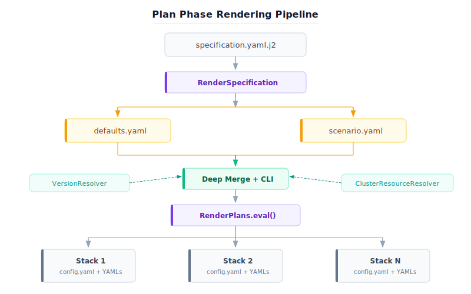

# Parser Module (Plan Phase)

The parser module handles the plan phase: rendering Jinja2 templates with merged configuration values to produce complete Kubernetes manifests, Helm values, and helmfile configurations.

## Module Structure

```text
parser/
    __init__.py
    render_specification.py       Specification file parsing and validation
    render_plans.py               Jinja2 template rendering engine
    render_result.py              Structured error tracking for renders
    config_schema.py              Pydantic config validation (typo/type detection)
    version_resolver.py           Auto-resolve image tags and chart versions
    cluster_resource_resolver.py  Auto-detect accelerator/network values
```

## Rendering Pipeline



## Components

### RenderSpecification

Parses and validates the specification file (`.yaml.j2`):
- Renders the specification as a Jinja2 template itself (resolving `base_dir`)
- Validates that required fields exist (`values_file`, `template_dir`)
- Resolves all paths to absolute paths
- Returns a dict with paths to defaults, templates, and scenario file

### RenderPlans

The main rendering engine:
- Loads `defaults.yaml` as the base configuration
- Deep-merges scenario overrides on top of defaults
- Applies `setup_overrides` from experiment setup treatments (when present)
- Applies CLI overrides (namespace, model, methods)
- Generates experiment treatments if specified
- For each treatment/stack:
  - Renders all Jinja2 templates with the merged config
  - Writes `config.yaml` (the merged config) alongside rendered YAMLs
  - Runs version resolution if configured
- Returns `RenderResult` with paths and any errors

**Key behaviors:**
- Templates with Jinja2 conditionals that evaluate to false render as empty files
- Each rendered stack gets its own directory under the plan output
- The `config.yaml` in each stack is the single source of truth for that stack's configuration

### ConfigSchema

Pydantic validation for the merged config dict:
- Detects typos in key config sections (`decode`, `model`, `vllmCommon`, `harness`, `prefill`)
- Catches type errors and constraint violations (e.g. `gpuMemoryUtilization > 1`)
- Non-blocking: `validate_config()` returns a list of warnings, never raises
- Sections use `STRICT_CONFIG` (typo detection) or `LENIENT_CONFIG` (extensible) as appropriate

### RenderResult

Structured error tracking for the rendering process:
- `rendered_paths` -- List of `Path` objects for each rendered stack directory
- `errors` -- List of rendering errors (template errors, missing files, etc.)
- `has_errors` -- Property that returns True if any errors occurred
- `to_dict()` -- Serializable representation for logging

### VersionResolver

Automatically resolves image tags and Helm chart versions:
- Queries container registries (quay.io, ghcr.io, etc.) for latest tags
- Resolves Helm chart versions from chart repositories
- Supports dry-run mode (skips network calls)
- Used during rendering to populate version fields with `"auto"` values

### ClusterResourceResolver

Auto-detects cluster resources during the plan phase:
- Queries cluster nodes for GPU/accelerator resources (e.g., `nvidia.com/gpu`)
- Detects network resources (e.g., RDMA devices)
- Populates config values that use `"auto"` as their value
- Supports dry-run mode

## Merge Strategy

The merge chain applies sources in order — later sources override earlier ones:

`defaults.yaml` → `scenario.yaml` → `setup_overrides` → resource preset → resolvers → CLI overrides

The deep merge follows these rules:
1. Scalar values: later source wins
2. Dicts: recursively merged (keys from both sources combined)
3. Lists: later source replaces entirely (no list concatenation)
4. `null` values: explicitly set the value to null (removes default)

## Usage from Code

The plan phase is triggered automatically by the CLI for `plan`, `standup`, `teardown`, `run`, and `experiment` commands:

```python
# In cli.py dispatch_cli():
specification_as_dict = RenderSpecification(
    specification_file=args.specification_file,
    base_dir=args.base_dir,
).eval()

render_result = RenderPlans(
    template_dir=specification_as_dict["template_dir"]["path"],
    defaults_file=specification_as_dict["values_file"]["path"],
    scenarios_file=specification_as_dict["scenario_file"]["path"],
    output_dir=config.plan_dir,
    version_resolver=version_resolver,
    cluster_resource_resolver=cluster_resource_resolver,
    cli_namespace=getattr(args, "namespace", None),
    cli_model=getattr(args, "models", None),
    cli_methods=getattr(args, "methods", None),
).eval()
```
